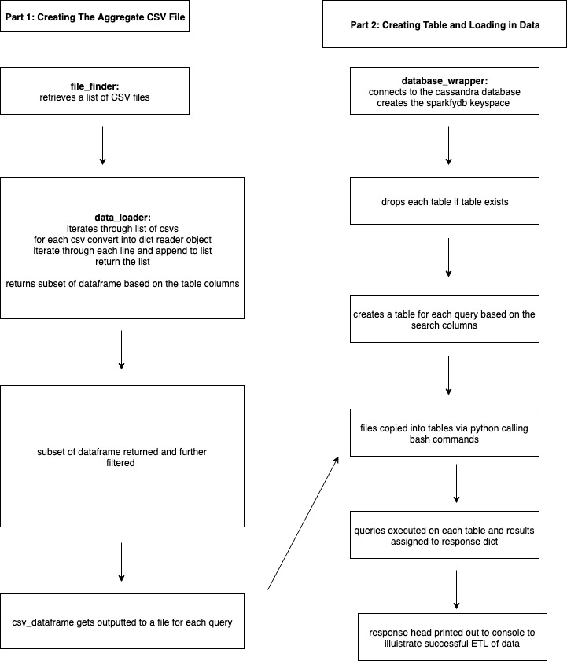

### NOSQL SPARKIFY ETL
#### Pipeline to aggregate csv files and load them into a Cassandra DB

#### Project Overview

Music company sparkify generate CSV files that record song play data in their app. The CSV files are aggregated and loaded into a Cassandra DB, where each table represents a particular query/piece of analysis.

#### App Architecture

#### Setup Via Jupyter Notebook

* Ensure python3 and cassandra are installed
* Ensure you have a cassandra cluster running
* Run cass_etl_exec.sh -> this will create a virtual env, install the dependencies & start the jupyter server
* Run jupyter notebook dmiller_cass_sparkify_notebook.ipynb
* Execute the jupyter notebook dmiller_cass_sparkify_project

Results should look something like this (without the warning message):

#### Additional Steps
* Use cqlsh to create tables and run them via bash. This separates out the DB and application logic further and allows for creation of composite clustering keys for ordering tables on multiple rows
* Look into one function for copying csv files to db and using interpolation for the table name & csv file
* Performance testing with more data or on a low memory VM/container to identify bottlenecks
* More queries and potentially also some data dashboards
* Unit and integration testing to provide documentation and ensure long term code robustness